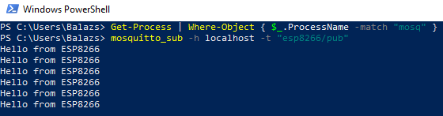
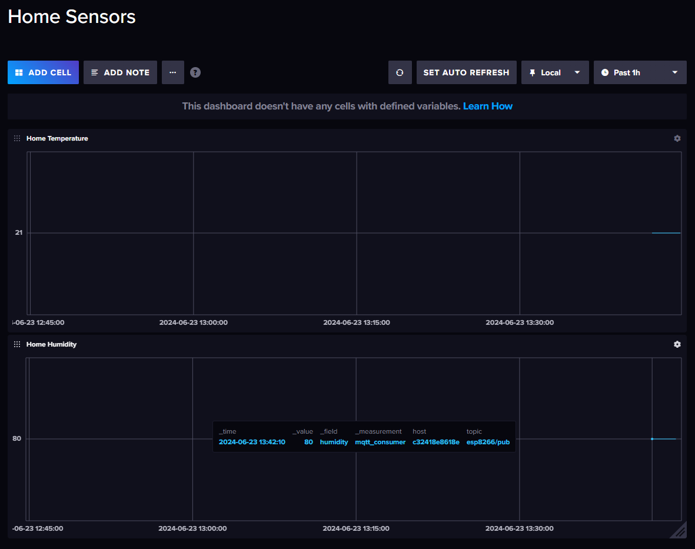

# IoT-minikube
Local Kubernetes pet project to receive IoT sensor data and display it in Grafana

# 1. Setting up workspace on my Windows PC
Setting Up WSL 2 & Docker Desktop

[https://minikube.sigs.k8s.io/docs/tutorials/wsl_docker_driver/](https://minikube.sigs.k8s.io/docs/tutorials/wsl_docker_driver/)

minikube start

[https://minikube.sigs.k8s.io/docs/start/?arch=%2Fwindows%2Fx86-64%2Fstable%2F.exe+download](https://minikube.sigs.k8s.io/docs/start/?arch=%2Fwindows%2Fx86-64%2Fstable%2F.exe+download)

Set Up Mosquitto MQTT Broker on Your PC

[https://mosquitto.org/download/](https://mosquitto.org/download/)

wsl
sudo apt-get update
sudo apt-get install mosquitto mosquitto-clients
mosquitto

## Test

mosquitto_sub -h localhost -t test/topic

In another terminal

mosquitto_pub -h localhost -t test/topic -m "Hello MQTT"

# 2. Let's run Mosquitto in docker
```
mkdir /home/iot-minikube/mosquitto

cd /home/iot-minikube/mosquitto

docker pull eclipse-mosquitto
```

## Run the Mosquitto container with the default configuration:

docker run -d --name mosquitto -p 1883:1883 -p 9001:9001 eclipse-mosquitto

Well, it runs, but I need to subscribe to a topic so I can check if messages arrive.

## Created mosquitto folder, now create Dockerfile and the config
Create Dockerfile:
```
vi Dockerfile
```
Inside:
```
# Use the official Mosquitto image from Docker Hub
FROM eclipse-mosquitto

# Expose MQTT port
EXPOSE 1883

# Copy your custom configuration file if needed
COPY config/mosquitto.conf /mosquitto/config/mosquitto.conf
```
Create config folder and config file
```
mkdir /home/iot-minikube/mosquitto/config
cd /home/iot-minikube/mosquitto/config
vi mosquitto.conf
```
Inside:
```
persistence true
persistence_location /mosquitto/data/
log_dest file /mosquitto/log/mosquitto.log

listener 1883

allow_anonymous true
```

## Build the Custom Docker Image
```
docker build -t custom-mosquitto .
```
## Create folders for data and log 
```
mkdir /home/iot-minikube/mosquitto/data
mkdir /home/iot-minikube/mosquitto/log
```
## Run custom container

```
docker run -d -p 1883:1883 --name my-mosquitto-container my-mosquitto-image
```

I can post messages to the broker and also subscribe to it so I can get the messages.

## Create 'main' folder for esp8266

```
mkdir /home/iot-minikube/mosquitto/main
cd /home/iot-minikube/mosquitto/main
```
Create main.ino
```
vi main.ino
```
Code for main.ino:
```
#include <ESP8266WiFi.h>
#include <PubSubClient.h>
#include <DHT.h>
#include <NTPClient.h>
#include <WiFiUdp.h>
#include <ArduinoJson.h>
#include "secrets.h" // Include the secrets file

#define DHTPIN 4        // Pin D4 (GPIO4)
#define DHTTYPE DHT22   // DHT 22 (AM2302)

WiFiClient espClient;
PubSubClient client(espClient);
DHT dht(DHTPIN, DHTTYPE);
float h ;
float t;
WiFiUDP ntpUDP;
NTPClient timeClient(ntpUDP, "pool.ntp.org", 0, 60000); // NTP client with 1 minute update interval

void setup() {
  Serial.begin(9600);  // Set baud rate to 9600
  setup_wifi();
  client.setServer(mqtt_server, mqtt_port);
  client.setCallback(callback);

  dht.begin();
  timeClient.begin();

  Serial.println("DHT sensor initialization complete");
}

void setup_wifi() {
  delay(10);
  Serial.println();
  Serial.print("Connecting to ");
  Serial.println(ssid);

  WiFi.begin(ssid, password);

  while (WiFi.status() != WL_CONNECTED) {
    delay(500);
    Serial.print(".");
  }

  Serial.println("");
  Serial.println("WiFi connected");
  Serial.println("IP address: ");
  Serial.println(WiFi.localIP());
}

void callback(char* topic, byte* payload, unsigned int length) {
  Serial.print("Message arrived [");
  Serial.print(topic);
  Serial.print("] ");
  for (unsigned int i = 0; i < length; i++) {
    Serial.print((char)payload[i]);
  }
  Serial.println();
}

void reconnect() {
  while (!client.connected()) {
    Serial.print("Attempting MQTT connection...");
    if (client.connect("ESP8266Client")) {
      Serial.println("connected");
      client.subscribe(SUBSCRIBE_TOPIC);
    } else {
      Serial.print("failed, rc=");
      Serial.print(client.state());
      Serial.println(" try again in 5 seconds");
      // Adding additional debug information
      Serial.print("MQTT Broker IP: ");
      Serial.println(mqtt_server);
      delay(5000);
    }
  }
}

void loop() {
  if (!client.connected()) {
    reconnect();
  }
  client.loop();

  timeClient.update();

  h = dht.readHumidity();
  t = dht.readTemperature();

  if (isnan(h) || isnan(t)) {
    Serial.println("Failed to read from DHT sensor!");
    delay(2000); // Wait for a bit before retrying
    return;
  }

  // Create JSON payload
  StaticJsonDocument<200> doc;
  doc["timestamp"] = timeClient.getFormattedTime();
  doc["temperature"] = t;
  doc["humidity"] = h;
  char jsonBuffer[200];
  serializeJson(doc, jsonBuffer);

  Serial.print("Publishing message: ");
  Serial.println(jsonBuffer);

  client.publish(PUBLISH_TOPIC, jsonBuffer);

  delay(2000);
}
```
Create secrets.h
```
vi secrets.h
```
Code for secrets.h:
```
#ifndef SECRETS_H
#define SECRETS_H

/* fill with your detail */
const char* ssid = "*****";
const char* password = "*****";

/* enter the ip of the host of the broker */
const char* mqtt_server = "192.168.x.y";
const int mqtt_port = 1883;

const char* PUBLISH_TOPIC = "esp8266/pub";
const char* SUBSCRIBE_TOPIC = "esp8266/sub";

#endif
```

## Getting NaN for sensor data

I am getting wrong sensor data but sending a simple hello message works.



# 3. Set up InfluxDB in docker

[https://www.influxdata.com/blog/running-influxdb-2-0-and-telegraf-using-docker/](https://www.influxdata.com/blog/running-influxdb-2-0-and-telegraf-using-docker/)

Following this article I was able to set up the 3 containers. Put two cells on a dashboard in Influxdb to see the two sensor data coming in live.


